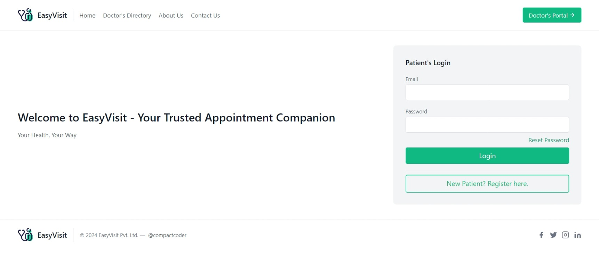
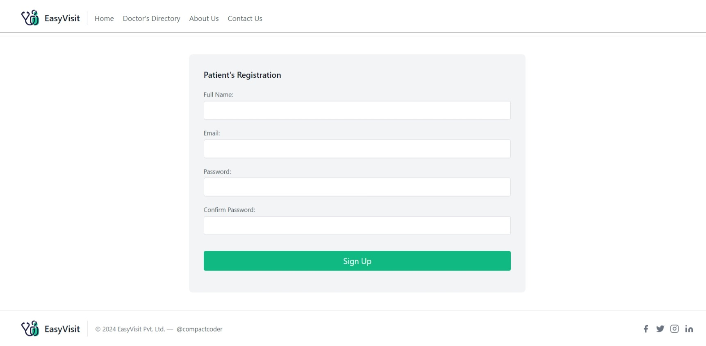
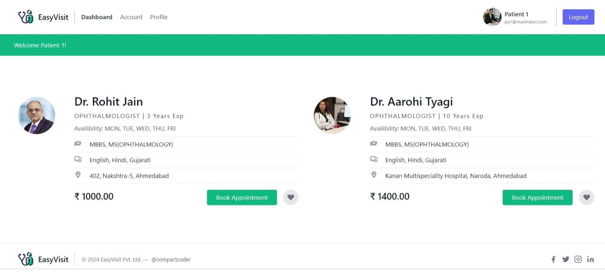
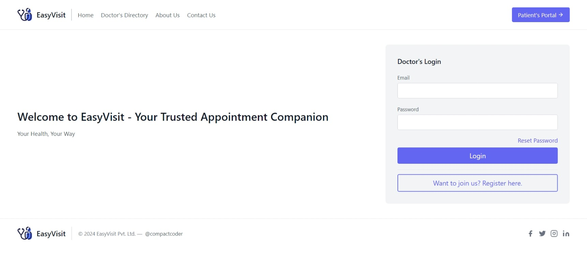
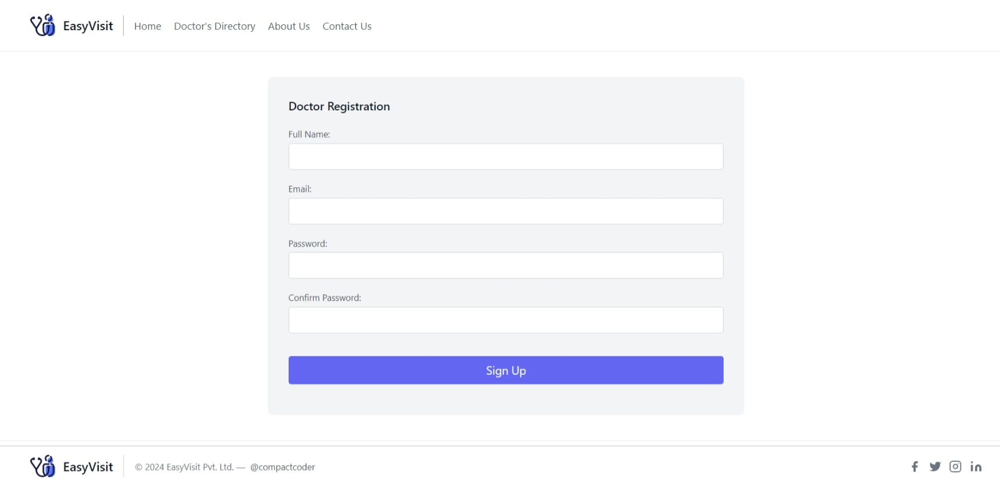
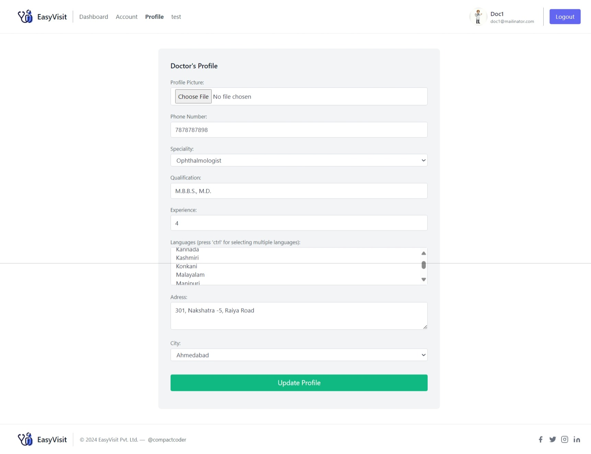

# EasyVisit
 EasyVisit - Appointment Companion

# EasyVisit - Patient Appointment Scheduling App

EasyVisit is a web-based application built with Flask and Tailwind CSS that provides a common platform for patients and doctors to schedule and manage appointments. The app is designed to streamline the appointment scheduling process, allowing patients to easily find doctors, view their availability, and book appointments, while enabling doctors to manage their schedules effectively.

## Features

- **Patient Registration and Login**: Patients can register for an account, log in, create their profile and manage their appointment bookings.
- **Doctor Registration and Login**: Doctors can sign up, log in, create their profile and manage their appointment schedules.
- **Appointment Scheduling**: Patients can view available doctors, check their availability, and book appointments.
- **Doctor Dashboard**: Doctors can view upcoming appointments and manage their availability.
- **Patient Dashboard**: Patients can view their scheduled appointments and update or cancel bookings if needed (yet to be implemented).
- **Notifications**: The system provides notifications for appointment confirmations and updates (yet to be implemented).
- **Secure Authentication**: Using Flask-Login and Flask-WTF for secure form handling and user authentication.

## Technologies Used

- **Backend**: Flask - A lightweight Python web framework.
- **Database**: SQLite3 - Used as a simple and efficient database for managing users and appointments.
- **ORM**: SQLAlchemy - An ORM to interact with SQLite3 in a more Pythonic way.
- **Frontend**: Tailwind CSS - A utility-first CSS framework for styling and responsive design.
- **Forms**: Flask-WTF - For secure form handling and validation.
- **Authentication**: Flask-Login - For managing user sessions and authentication.

## Installation and Setup

1. **Clone the repository**:
   ```bash
   git clone https://github.com/yourusername/easyvisit.git
   cd easyvisit

2. **Set up a virtual environment (optional but recommended)**:
    python3 -m venv venv
    source venv/bin/activate   # On Windows use `venv\Scripts\activate`

3. **Install the dependencies:**
    pip install -r requirements.txt

4. **Run the app**:
    flask run

5. **Access the app**:
    Open your browser and go to http://127.0.0.1:5000

## Screenshots

### Homepage - Patients-Login

### Patient Registration

### Patient Profile

### Patient Dashboard

### Patient/Doctor Email - Verification


### Doctor Login

### Doctor Registration

### Doctor Profile

